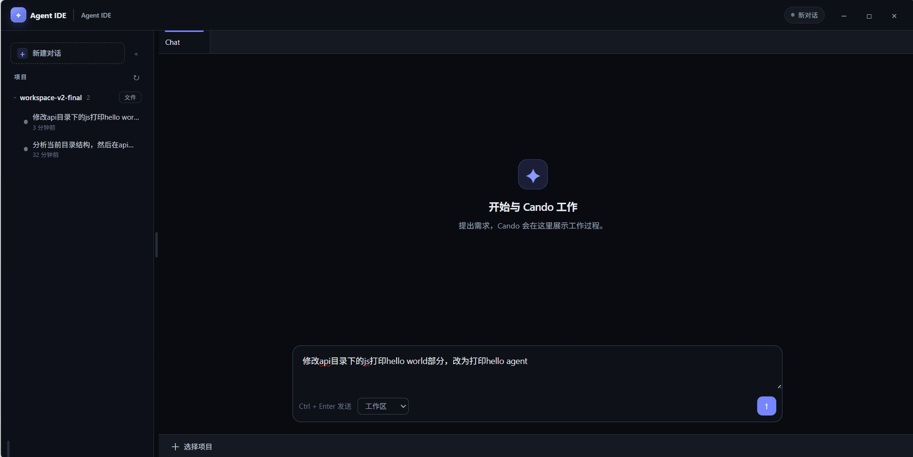
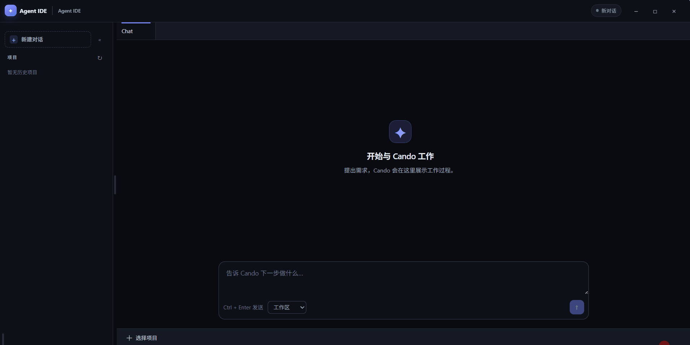
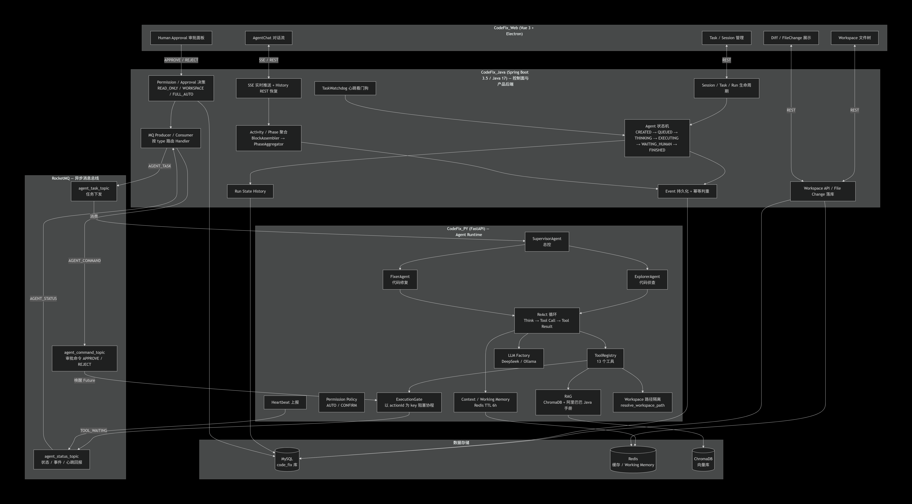

# AI Coding Agent

[English](README_EN.md) | [中文](README.md)

A long-running Coding Agent / Agent IDE for individual developers.

Built with **Java + Python + Vue**, featuring full Session / Task / Run / Event lifecycles, Tool Calling, Human Approval, Workspace file operations, Event persistence, long-task execution, and real-time visualization with history recovery.

> **Java** serves as the **control plane and product backend**, **Python** serves as the **reasoning and execution runtime**, and the **Web frontend** presents structured execution states as a "user-friendly Agent working process."

---

## Demo

**Single Agent:**

> The `master` branch tracks `CodeFix_0.1.1`, which is the single-agent mode.



**Multi-Agent:**

> Multi-agent mode is on the `CodeFix_0.2.0` branch.



---

## Introduction

This system solves one core problem: **A user submits a coding task in natural language, and the Agent actually completes it**, rather than just generating a text response.

Users can initiate tasks in the UI, such as *"Check the current project structure and locate N+1 queries."* The Agent will:

- Explore the Workspace.
- Read / Search / Modify / Delete files.
- Execute Java syntax validation and structural parsing.
- Delegate to Explorer (reconnaissance) and Fixer (repair) sub-agents as needed.
- Wait for human approval before sensitive operations like file modifications.
- Continuously execute multi-turn ReAct loops over long periods.
- Present the work process and results to the user.

The system consists of three independent codebases:

| Codebase | Role |
| :--- | :--- |
| `CodeFix_Java` | Control Plane / Product Backend: Task, Run, State, Event, Approval, Workspace, Aggregation, SSE |
| `CodeFix_PY` | Agent Runtime: Supervisor, ReAct, LLM, Tools, Context, Approval Gating |
| `CodeFix_Web` | Frontend: Tasks, Sessions, Chat Process, File Changes, Diff, Workspace Visualization |

---

## Why This Project?

While frameworks like **LangChain** and **LangGraph** are powerful, they often over-abstract the development process. A simple text generation call might traverse through `chain`, `LLMChain`, `BaseLLM`, `BaseOpenAI`, and several other classes before reaching the LLM. Moreover, LangChain's version changes are frequent, forcing constant code modifications even when business logic hasn't changed.

The cost of this generality is hidden prompts and opaque call chains — essentially a black-box state.

**Framework approach:** `User -> Framework -> Result`

> **Real-world case study:** Octomind used LangChain for over a year before deciding to build their own ReAct implementation. They needed to dynamically adjust available tools during Agent execution, which LangChain's mechanism did not support. The intermediate operations were encapsulated, making debugging difficult, and custom operations were extremely hard to implement.

Therefore, we recommend developers call APIs directly. However, building from scratch is not about reinventing the wheel, but rather:

1. **Absolute control over ReAct**: Observable, intervenable, and interceptable.
2. **Extreme compression of context engineering and cost**: Frameworks often have redundant encapsulated prompts for generality, which disrupts prefix alignment and may cause server-side prompt caching to fail.
3. **Scheduling capabilities**: From detailed tool execution flows to macro-level tool sequencing and concurrency.

**Custom ReAct approach:** `User -> Custom Operation Details -> Observe -> Result`

While a standard Chat is a "one-off Q&A":

```text
User
 ↓
LLM
 ↓
Answer
```
A Coding Agent is a continuous engineering task:
```text
User
 ↓
Task
 ↓
Run
 ↓
Think
 ↓
Tool Call
 ↓
Tool Result
 ↓
Think
 ↓
Tool Call
 ↓
...
 ↓
Finish
```

Therefore, the engineering challenges are not just "how to call an LLM," but also:

- Long-running task lifecycle (Task / Run / Event).

- State management and context across multiple Tool Calls.

- Failure / Retry / Resume / Cancel.

- Human approval for sensitive operations (Approval).

- Workspace read, modification, and change tracking.

- Observability (real-time UI) and recoverability (history restoration after page refresh).

- Asynchronous message collaboration between Java, Python, and the frontend.

> This is an Agent Engineering / Agent Platform project, not just an LLM Demo.

---

## Core Capabilities
|Capability	|Description|
| -------------- | ------------------------------------------------------------ |
|Long-running Task|	Dispatched asynchronously via MQ. Java orchestrates without blocking HTTP, supporting multi-turn continuous execution.|
|Task / Run Lifecycle|	Task and Run are separated; one Task can correspond to multiple Runs (Retry / Resume).|
|State Machine| Java-side state machine drives CREATED → QUEUED → THINKING → EXECUTING → WAITING_HUMAN → FINISHED / ERROR / CANCELLED.|
|Event Persistence|	Every Agent Event reported by Python is persisted with idempotent deduplication.|
|Run State History|	Records the from → to, trigger source, and reason for each state transition.|
|Tool Calling|	12 tools for file read/write, search, syntax validation, parsing, and sub-agent delegation.|
|Human Approval|	High-risk operations enter WAITING_HUMAN; Java approves or rejects before proceeding.|
|Permission Profile|	READ_ONLY / WORKSPACE / FULL_AUTO policies.|
|Workspace|	Python tools restrict file paths to the Workspace root; changes are recorded and generate a diffId.|
|Realtime UI|	SSE pushes BLOCK_APPEND / BLOCK_UPDATE / RESULT_REFRESH.|
|History Restore|	After a page refresh, events are re-aggregated with the same semantics for display.|
|Activity Aggregation|	Low-level Events are aggregated into user-understandable Activity / Phase blocks.|
|Multi-Agent	|Supervisor + Explorer + Fixer.|
|RAG Manual Query|	Retrieves clauses from the Alibaba Java Development Manual to provide authoritative references for repair suggestions.|

## High-Level Architecture


```text
                    ┌─────────────────────────────┐
                    │       CodeFix_Web (Vue)     │
                    │  Workspace / Task / Chat    │
                    │  AgentChat / Diff / Review  │
                    └──────────────┬──────────────┘
                                   │ HTTP (REST) / SSE
                                   ▼
                    ┌─────────────────────────────┐
                    │   CodeFix_Java (Spring Boot)│
                    │                             │
                    │ Session · Task / Run        │
                    │ State Machine · Event       │
                    │ Approval / Permission       │
                    │ Workspace API · Activity    │
                    │ Phase Aggregation · SSE/History │
                    └──────────────┬──────────────┘
                                   │ RocketMQ (Async)
                                   ▼
                    ┌─────────────────────────────┐
                    │   CodeFix_PY (Agent Runtime)│
                    │                             │
                    │ Supervisor · ReAct · Tool   │
                    │ LLM · Context · Execution   │
                    │ Gate · Worker Agent         │
                    │ Heartbeat · Working Memory  │
                    └─────────────────────────────┘
```

## Collaboration Model
- Java: Control plane and product backend — "How the system runs and how users control it."

- Python: Agent Runtime and intelligent execution — "How the Agent thinks and executes."

- RocketMQ: Asynchronous message bus between Java and Python (task dispatch / status reporting / heartbeat).

- Frontend: User interaction and visualization of the Agent's working process.

## Java / Python Responsibilities
### Java Backend (CodeFix_Java)
- Session / Task / Run creation and lifecycle management.

- Agent state machine and transition guards (Event / Command / ActionCommand transition tables).

- Event persistence and idempotent deduplication.

- Run state history recording.

- MQ Producer / Consumer and message dispatch (routing by type to different Handlers).

- Approval and permission decisions (ALLOW / ASK / DENY, READ_ONLY / WORKSPACE / FULL_AUTO).

- File change parsing, persistence, and diffId generation.

- Activity / Phase aggregation (AgentChatBlockAssembler → AgentPhaseAggregator → AgentChatAssemblerService).

- SSE real-time push and REST history recovery.

- Workspace tree / file read and file update APIs.

- Heartbeat maintenance and Task Watchdog framework.

### Python Agent Runtime (CodeFix_PY)
- SupervisorAgent (orchestrator), ExplorerAgent / FixerAgent (workers).

- ReAct execution loop (Think → Tool Call → Tool Result).

- Tool Registry / Tool Schema / parameter validation.

- Tool Execution and path isolation (restricted to the Workspace root).

- ExecutionGate: Truly blocks the current Agent coroutine and waits for Java's APPROVE / REJECT.

- Tool Policy: Declares whether a tool is AUTO or CONFIRM.

- Context / Working Memory: Message window, compression, and Redis working memory (TTL 6h).

- Heartbeat reporting.

- LLM clients (DeepSeek / Ollama) and LLM Factory.

- RAG (chromadb + Alibaba Java Development Manual) for search_manual.

> Summary: Java is responsible for "how the system runs and how users control it," while Python is responsible for "how the Agent thinks and executes."

```text
Session
  └── Task
        └── Run
              └── Action
              └── Event

Session ─── Workspace
```

### Relationships
```text
Session : Task   = 1 : N
Task    : Run    = 1 : N  
Retry → Creates a new Run
Resume → Resumes the current Run
Cancel → Terminates the current Run
Run     : Event  = 1 : N
Run     : Action = 1 : N
Session : Workspace = N : 1
```

### Entity Descriptions (Java DO, MySQL code_fix database)
- Session (AgentSessionDO): Context container for a continuous conversation, recording workspaceId and title.

- Task (AgentTaskDO): A specific work task proposed by the user (question, status, lastHeartbeatAt).

- Run (AgentRunDO): An actual execution of a Task (runId, actionId, permissionProfile, attempt, startedAt / endedAt).

- Run State History (AgentRunStateHistoryDO): from / to / trigger / reason for each state transition.

- Action (AgentActionDO): An approval-pending event generated during Agent execution. (ActionId, RunId) controls the approval of a single event.

- Event (AgentEventDO): Raw facts generated during Agent execution (event, step, agentName, parentAgent, output). messageId ensures idempotency.

- File Change (AgentFileChangeDO): Records of Agent modifications to Workspace files (diffId, filePath, operation, addedLines / removedLines, diffText).

- Chat Message (ChatMessageDO): USER / ASSISTANT level dialogue messages, used for final answers and context building.

- Workspace (WorkspaceDO): The workspace where the Agent actually reads / modifies code.

## Agent Execution Flow
```text
User
 ↓
Java creates Task + Run (createTaskWithRun)
 ↓
Java assembles AGENT_TASK message and publishes to agent_task_topic
 ↓
Python SupervisorAgent starts the Run
 ↓
Think (THINK event reported)
 ↓
Tool Call (TOOL_CALL event reported)
 ↓
Tool Result (TOOL_RESULT event reported)
 ↓
Think ...
 ↓
Finish (FINISH event reported → Java persists ASSISTANT message)
```

### Human Approval Flow
```text
Tool Call
     ↓
Need approval?
 ┌───┴────┐
 No       Yes
 │         │
Execute   Python ExecutionGate blocks (TOOL_WAITING)
 │         ↓
 │      Java persists WAITING_HUMAN and pushes Approval Block
 │         ↓
 │      Java APPROVE / REJECT (AGENT_COMMAND + actionId)
 │         ↓
 │      ExecutionGate.resolve(actionId, ALLOW/DENY)
 │         ↓
 │      Continue execution / Reject
```

Role of actionId: Strictly binds the current pending Tool Call with the APPROVE / REJECT command issued by Java (Python's ExecutionGate waits on a Future keyed by action_id), preventing "approved A but executed B."

--- 

## Long-Task Design
The system is not a simple "HTTP → Python Agent → synchronous wait" model:
```text
HTTP
 ↓
Python Agent
 ↓
Wait for completion
 ↓
Response
```
Instead, tasks are modeled as persistable, recoverable, and approvable asynchronous execution units:
```text
Task
 └── Run
      ├── State (State Machine)
      ├── Event (Raw execution facts, persisted)
      ├── Tool execution (Controlled by ExecutionGate)
      └── lifecycle (Retry / Resume / Cancel)
```

Implemented mechanisms:

- Task / Run Separation: createTaskWithRun creates the Session / Task / Run / Workspace association in a single message.

- State Machine Driven: Java AgentTaskStateMachine manages transitions triggered by Event / Command / ActionCommand via three transition tables.

- Event Persistence: All Python-reported events are first persisted to agent_event; DuplicateKeyException deduplication provides natural idempotency.

- Run State History: agent_run_state_history is written only when the state actually changes.

- Retry / Resume / Cancel: POST /api/agent/tasks/{taskId}/retry|resume|cancel. Java transitions the state first, then sends the MQ command.

- Auto-Approval: Tool calls matching the permission policy (ALLOW / REJECT) are internally commanded by Java immediately, without interrupting the Agent.

- Local Directory Operations: The Agent explores and modifies local directories using tools. Multiple sessions can operate on the same directory space, controlled by Root_Path.

- Heartbeat: Python periodically reports AGENT_HEARTBEAT; Java updates lastHeartbeatAt. TaskWatchdog scans running tasks every 5s for those exceeding 15s without a heartbeat.

---
## Tool System
Tools are registered in Python's ToolRegistry (App/agent_boost/tools/tool_registry.py). Currently there are 13 tools:
|Tool|	Purpose|
|------------------|------------------|
|list_files|	List files and directories in the Workspace|
|read_file|	Read a file|
|glob|	Find files by pattern|
|grep|	Search text / class names / method names / config items in the Workspace|
|write_file|	Create a new file|
|delete_file|	Delete a file|
|apply_patch|	Precisely modify an existing file (generates Unified Diff)|
|verify_java_syntax|	Call Java /api/validate to validate Java syntax (Deprecated)|
|parse_java_code|	Call Java /api/parse (JavaParser) to parse Java structure (Deprecated)|
|search_manual|	Retrieve coding standard clauses from the Alibaba Java Development Manual|
|run_explorer|	Delegate to Explorer sub-agent for code structure analysis|
|run_fixer|	Delegate to Fixer sub-agent for code repair|
|run_command|	Execute system commands in the current directory|
Different Agents have different tool sets (AgentToolSet):
Single Agent:
- `SUPERVISOR`：`list_files` / `glob` / `grep` / `read_file` / `write_file` / `apply_patch` / `delete_file` / `run_explorer` / `run_fixer`
- `EXPLORER`：`list_files` / `glob` / `grep` / `read_file` / `parse_java_code（将废弃）`
- `FIXER`：`list_files` / `glob` / `grep` / `read_file` / `write_file` / `apply_patch` / `delete_file` / `search_manual` / `verify_java_syntax（将废弃）` / `run_command`

Multi-Agent:
- `SUPERVISOR`： `run_explorer` / `run_fixer`
- `EXPLORER`：`list_files` / `glob` / `grep` / `read_file` / `parse_java_code（将废弃）`
- `FIXER`：`list_files` / `glob` / `grep` / `read_file` / `write_file` / `apply_patch` / `delete_file` / `search_manual` / `verify_java_syntax（将废弃）` / `run_command`

---
## Permission / Approval / ActionId
### Permission Profiles
```text
READ_ONLY   Only read and query operations allowed; file modifications prohibited.
WORKSPACE   File modifications allowed within the specified Workspace.
FULL_AUTO   Agent automatically executes all supported operations.
```
(PermissionProfileEnum, recorded on the Run.)
### Decision & Approval
```text
Agent
 ↓
Tool Call
 ↓
Permission Policy Evaluator (tool + path rules + profile)
 ↓
ALLOW ────────> Java automatically issues APPROVE, Agent executes directly
ASK  ─────────> Enters WAITING_HUMAN, SSE pushes Approval Block
DENY ─────────> Java automatically issues REJECT, Agent is rejected
```

- Python declares default permissions for each tool (tool_policy.py, default is CONFIRM).

- Java's PermissionService.evaluate combines the Run's permissionProfile with runtime permission policies/cache to make decisions.

- When human intervention is needed, Python's ExecutionGate blocks the current Agent coroutine keyed by actionId.

- The user APPROVEs / REJECTs in the frontend → Java AgentCommandService → MQ AGENT_COMMAND → Python wakes up the corresponding Future.

> Note: The current permission control is a "product-level tool/path approval" mechanism. OS-level sandbox / container isolation is not implemented in this repository.

---

## Event → Activity → Phase → UI
Underlying Events are not directly shown to users; they undergo multi-layer aggregation:
```text
Agent Event (TOOL_CALL / TOOL_WAITING / TOOL_RESULT / THINK / ERROR ...)
     ↓
AgentChatBlockAssembler
     ↓
Activity Block (type: action / file_change / review)
     ↓
AgentPhaseAggregator
     ↓
Phase (ANALYSIS / IMPLEMENTATION / VERIFICATION / SUBTASK / ERROR)
     ↓
AgentChatAssemblerService → AgentChatViewVO / AgentChatStreamVO
     ↓
Frontend
```

## What is a Phase?
**Phase is an internal aggregation container on the backend, not a UI layer that users must see.**
- AgentChatBlockAssembler converts a single Event into an Activity Block (containing summary, action, status, actionId, requiresApproval, etc.).

- AgentPhaseAggregator aggregates Blocks into Phases by work stage, for example:
```text
Phase "Analyze Problem" (ANALYSIS)
 ├── narration (Agent text narration)
 ├── action (Read src/...)
 ├── action (Search ...)
 └── narration
Phase "Modify Code" (IMPLEMENTATION)
 ├── narration
 ├── file_change
 └── narration
```
The frontend renders Blocks sequentially, forming a narrative flow similar to "the Agent is working.
### Narration vs. Reasoning
- The user-facing content in Agent events is work narration, which is displayed.

- The model's internal reasoning is part of the internal reasoning process and is not displayed as product UI narration.

---

## Realtime / History Consistency
Both the real-time and history pipelines use the same product semantics for Activity aggregation:
```text
Realtime (SSE):
Python Agent Event → Java Persistence → AgentChatStreamAssembler → SSE → Frontend

History (REST):
MySQL AgentEvent → AgentChatBlockAssembler → AgentChatAssemblerService → REST → Frontend
```
- During a task, the frontend connects to GET /api/agent/tasks/{taskId}/stream via EventSource.

- SSE event types: BLOCK_APPEND / BLOCK_UPDATE / RESULT_REFRESH (AgentChatStreamVO.type).

- After a page refresh, GET /api/agent/sessions/{sessionId}/chat can be called to retrieve the complete AgentChatViewVO (turns + phases) to restore the same visual state.

## Workspace
All Agent file operations occur within a dedicated Workspace:
```text
Workspace (Root directory, e.g., /data/workspaces/<id>)
    ↓
Tool (list_files / read_file / glob / grep / write_file / apply_patch / delete_file)
    ↓
Path Isolation (Python resolve_workspace_path strictly restricts to root; out-of-bounds throws PermissionError)
    ↓
File Change (created / modified / deleted, records added/removed lines and Unified Diff)
    ↓
Java persists agent_file_change and generates diffId
    ↓
Activity / Diff display
```

- On the Python side, each Run binds to a workspace via run_context.workspace.

- On the Java side, Workspace APIs are exposed:
   - GET /api/agent/workspace (List Workspaces)

   - GET /api/agent/workspace/{workspaceId}/tree

   - GET /api/agent/workspace/{workspaceId}/file?path=...

   - PUT /api/agent/workspace/{workspaceId}/file
 
- File changes can be viewed via GET /api/agent/diffs/{diffId}.

> Note: The current implementation does not include container / sandbox isolation, only application-level path isolation and change tracking.

---
## Quick Start

### Requirements
|Dependency|	Version / Notes
| -------- | ----------------------------------------------------- |
|Java	|17 (pom.xml java.version=17)|
|Maven	|For building CodeFix_Java|
|Python|	3.x (dependencies in CodeFix_PY/requirements.txt)|
|Node.js|	For building / running CodeFix_Web (Vite)|
|MySQL	|Database name code_fix (see application.yaml)|
|Redis|	Used by both Java and Python (session, cache, Working Memory)|
|RocketMQ	|Namesrv + Broker (Java and Python communicate through it)|

### Directory Structure
```text
project/
├── CodeFix_Java/     # Spring Boot Platform Backend (Control Plane)
├── CodeFix_PY/       # Python Agent Runtime
├── CodeFix_Web/      # Vue Frontend
└── README.md
```

### Backend（CodeFix_Java）
1. Prepare MySQL (create database code_fix), Redis, RocketMQ.

2. Modify the connection configurations in CodeFix_Java/src/main/resources/application.yaml (MySQL address / credentials, Redis, mq.rocketmq.name-server, consumer / producer group and topic).
3. Start:
```bash
cd CodeFix_Java
mvn spring-boot:run
```
Default listening address: http://localhost:8080.
### Agent (CodeFix_PY)
1. Prepare the Python environment and install dependencies:
```bash
cd CodeFix_PY
python -m venv .venv
pip install -r requirements.txt
```
2. Copy the template and fill in environment variables (LLM, MySQL/Redis/RocketMQ, Ollama, Embedding, Workspace root, etc.):
```bash
cp .env.example .env
```
3. Start (defaults to 0.0.0.0:8000; subscribes to RocketMQ messages on startup):
```bash
python App/main.py
```
### Frontend（CodeFix_Web）
1. Install dependencies:
```bash
cd CodeFix_Web
npm install
```
3. Development environment backend address defaults to http://localhost:8080 (see .env.development):
```bash
npm run dev
npm run electron 
```
> Note: The Dockerfile and CodeFix_PY/docker-compose.yml in CodeFix_Java, CodeFix_PY, and CodeFix_Web are currently placeholders and do not contain usable container orchestration content.

---

## Configuration
Core configuration items (Please use environment variables or local configurations for sensitive information; do not commit them to the repository):
|Config Area|	Location / Example|	Description|
| ---------------- | -------------------------------------------------- | ----------------------------- |
|Java Port	|server.port (default 8080)	Backend service port|
|MySQL|	spring.datasource (database code_fix)	Persistence|
|Redis|	spring.data.redis / REDIS_URL	Cache / Working Memory|
|RocketMQ	|mq.rocketmq.name-server, group, topic	Task / Status / Heartbeat messages|
|LLM Provider	|LLM_API_KEY / LLM_BASE_URL / LLM_TIMEOUT	DeepSeek and other OpenAI-compatible interfaces|
|Ollama|	OLLAMA_BASE_URL	Local inference / Embedding|
|Embedding	|EMBEDDING_BASE_URL / EMBEDDING_MODEL	chromadb vector store Embedding|
|Workspace Root|	WORKSPACE_ROOT (default /data/workspaces)	Root directory for Python tool access|
|Java Backend URL|	BACKEND_BASE_URL (default http://localhost:8080)	Python calls Java auxiliary interfaces|
> CodeFix_PY/.env.example exists as a template file. Please fill in the values according to your local environment.
The README does not contain any real API Keys / Passwords / Tokens / Private network addresses.

---

## Project Structure
### Java（CodeFix_Java）
```text
src/main/java/com/xd/
├── controller/        # REST / SSE interfaces (sessions, tasks, workspace, diffs, parse, validate)
├── service/
│   ├── impl/          # Session/Task/Run/Event/Approval/SSE/Aggregation implementations
│   ├── TaskDispatcher # Routes MQ messages by type
│   └── ...
├── assembler/         # AgentChatBlockAssembler / AgentPhaseAggregator / AgentChatStreamAssembler ...
├── runtime/
│   ├── state/         # State machine + transition guards
│   └── permission/    # Permission policy evaluator / runtime cache
├── mq/                # MQProducer / Listener / TopicInitializer / MessageHandler
├── mapper/            # MyBatis Mapper (Java interfaces)
├── model/
│   ├── entity/        # DO (session/task/run/event/file_change/chat_message/workspace...)
│   ├── dto/           # Message and request DTOs (AgentTaskMessage / AgentMessageDTO ...)
│   ├── vo/            # Display VOs (AgentChatViewVO / PhaseVO / BlockVO / StreamVO ...)
│   ├── enums/         # State / Event / Command / Permission enums
│   └── context/       # SessionContext / TaskRunContext ...
├── scheduler/         # TaskWatchdog (Heartbeat Watchdog)
├── config/            # Web / Redis / RocketMQ / Transaction configurations
└── resources/
    ├── application.yaml
    └── com/xd/mapper/*.xml   # MyBatis SQL
```

### Python（CodeFix_PY）
```text
App/
├── main.py              # FastAPI entry (lifespan starts/stops MQ)
├── config.py            # Environment variable configuration (LLM / MQ / Redis / Workspace / VectorDB)
├── bootstrap/
│   └── mq_bootstrap.py  # RocketMQ Consumer bootstrapping and message type registration
├── agents/
│   ├── base_agent.py / react_agent.py / tool_executor.py   # ReAct execution foundation
│   ├── supervisor/supervisor_agent.py                      # Orchestrator Agent
│   ├── worker/explorer_agent.py / fixer_agent.py           # Worker Agent
│   ├── control/execution_gate.py / tool_policy.py / agent_command_service.py
│   ├── manager/agent_run_manager.py / agent_tool_manager.py
│   ├── memory/             # context / message / token / working memory
│   ├── agent_model/        # LLMMessage / ToolCall / LLMResponse ...
│   ├── context/            # AgentContext / AgentRunContext
│   └── agent_state.py
├── agent_boost/
│   ├── tools/tool_registry.py     # 13 tools
│   ├── tool_model/tool_schemas.py # Tool parameter schemas
│   └── rag/
├── services/
│   ├── agent_msg_service.py       # AGENT_TASK processing and AGENT_STATUS reporting
│   ├── llm_service/ (ollama / deepseek)
│   ├── factory/llm_factory.py
│   ├── rag_service.py             # chromadb retrieval for Alibaba Java Manual
│   └── redis_working_memory_store.py
├── infrastructure/        # mq / redis / heartbeat / files_search / message / handler
└── models/                # Messages / Events / Commands / Workspace / Session data models
```

### Frontend（CodeFix_Web）
```text
src/
├── electron/     # Desktop shell, mainly used to obtain the absolute path of local directories
├── api/          # http wrapper + task / session / workspace / diff
├── stores/       # Pinia (task: task + SSE; session: session and chat)
├── views/        # Workspace.vue (Main UI) / TaskList / TaskCreate
├── components/   # AgentChat / AgentActionBlock / FileChangeBlock / ReviewBlock
│                 # DiffViewer / CodeViewer / Editor / WorkspaceTree ...
├── router/       # Vue Router
├── types/        # task / event / agentChat types
└── config/       # API / SSE addresses (reads from .env)
```

---
## Roadmap
###Current (Implemented)

- ☑ Session / Task / Run lifecycle and relationship modeling
- ☑ Agent state machine (Event / Command / ActionCommand transitions) + transition guards
- ☑ Agent Event persistence and idempotent deduplication
- ☑ Run state history recording
- ☑ Retry / Resume / Cancel
- ☑ Tool Registry and ReAct execution loop (Python)
- ☑ Tool Permission (AUTO / CONFIRM) and Permission Profile (READ_ONLY / WORKSPACE / FULL_AUTO)
- ☑ Human Approval: ExecutionGate blocking + Java APPROVE / REJECT + actionId binding
- ☑ Workspace file operations and path isolation
- ☑ File Change recording (diffId / unified diff) and Diff viewing
- ☑ Activity / Phase aggregation display (Event → Block → Phase → UI)
- ☑ SSE real-time push and history recovery (same aggregation semantics)
- ☑ Sub-agents: Supervisor + Explorer + Fixer
- ☑ RAG retrieval from Alibaba Java Development Manual (search_manual)
- ☑ Python Working Memory (Redis, message serialization storage)
- ☑ Heartbeat reporting and Java-side Watchdog scanning framework
- ☑ Workspace creation

### Next / Planned

- □ Implementation of sandbox isolation mechanisms
- □ Agent streaming output
- □ Agent operation rollback
- □ Display of effective information (token consumption, elapsed time, etc.)
- □ User / login / account-level permission system
- □ More complete Docker / docker-compose one-click orchestration (currently placeholder files)
- □ Unit / integration test coverage (currently CodeFix_Java only contains startup smoke tests)
- □ Session-level long-task history archiving and retrieval
- □ More LLM Provider adaptations and context compression strategy tuning

> Note: The items in "Next" above are currently not yet completed in the repository.

---
## Tech Stack
|Layer|	Technology
| ------------------------- | -------------------------------------------------- |
|Frontend|	Vue 3 / Pinia / Vue Router / Element Plus / Axios / Electron|
|Editor / Diff|	Monaco Editor / highlight.js / vue-markdown-render|
|Backend	|Java 17 / Spring Boot 3.5|
|ORM|	MyBatis (mybatis-spring-boot-starter 3.0.3)|
|Messaging|	RocketMQ (client 5.3.3, FIFO status topic)|
|Database|	MySQL (database code_fix)|
|Cache / Working Memory|	Redis|
|Agent Runtime|	Python / FastAPI / Uvicorn|
|Agent Models / Validation|	Pydantic|
|Code Analysis|	JavaParser (core 3.28.0) / JavaSyntaxValidator|
|Realtime|	SSE (SseEmitter + EventSource)|
|RAG / Embedding|	ChromaDB / Ollama Embedding / pypdf|
|JSON Processing|	fastjson2 / Jackson|

---

## License

This project is licensed under the MIT License.
